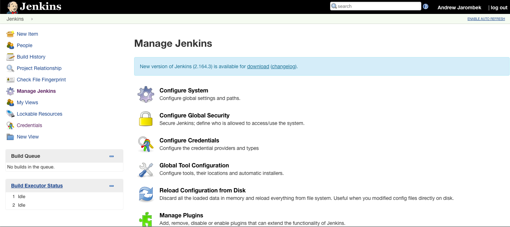
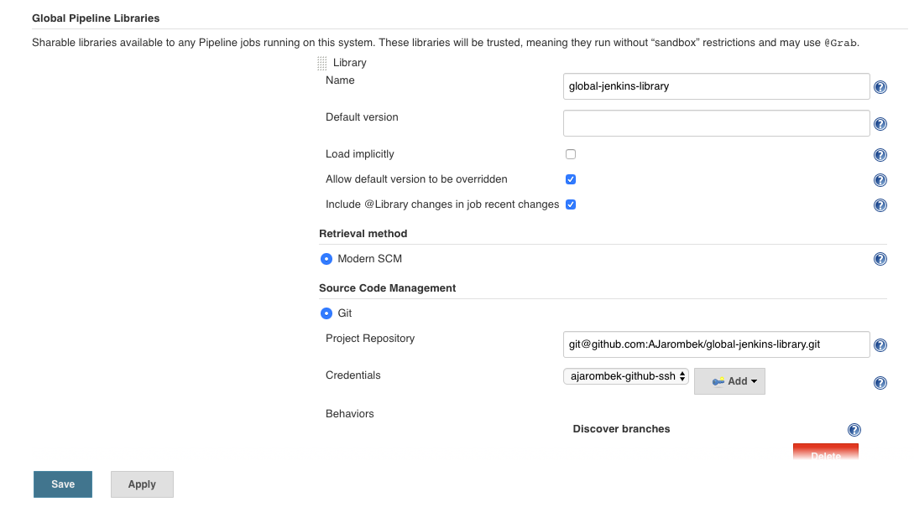

# global-jenkins-library

Reusable functions for use in Jenkins pipelines.

### Jenkins Server Setup

> Jenkins Server v2 on Kubernetes performs this setup in the CasC YAML file. 

To implement this repository as a library on the Jenkins server, the following actions are required:

1) Go to the Jenkins server (in my case `jenkins.jarombek.io`) and click on 'Configure Jenkins'.



2) Click on 'Configure System' and scroll down to 'Global Pipeline Libraries'.  Enter values into the fields shown in 
the following image:



### Repository Structure

Jenkins has a set pattern for a repository used as a 
[Shared Library](https://jenkins.io/doc/book/pipeline/shared-libraries/).  The `vars` directory holds files that are 
exposed as variables in the Jenkins pipeline. For example, the `terraformApply()` function in `vars/terraform.groovy` is 
accessible in a Jenkins pipeline like so:

```groovy
// Import the Global Pipeline Library
@Library(['global-jenkins-library@master']) _

terraform.terraformApply('path/to/tf', 'repo_name', true)
```

### Directories

| Directory Name    | Description                                                                   |
|-------------------|-------------------------------------------------------------------------------|
| `images`          | Images used in the Markdown documentation.                                    |
| `vars`            | Groovy files exposed as variables in Jenkins pipelines.                       |